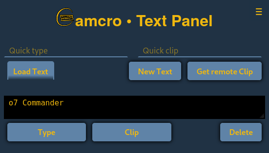
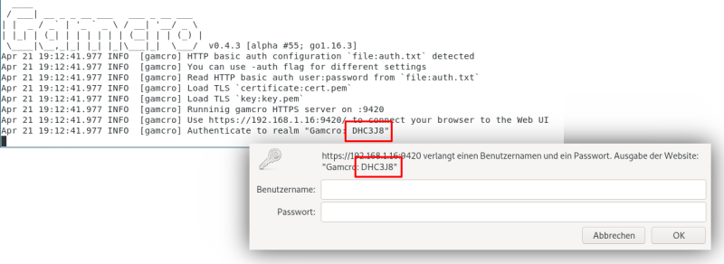

# amcro
[](https://goreportcard.com/report/github.com/CmdrVasquess/gamcro)

Gamcro: Game Macros allows you to send input from another machine to
the program on your computer that is currently active, aka which is in
the foreground. This can be rather useful, e.g. when playing a
computer game.

_But before you continue: Keep in mind that programs like Gamcro can
also be a serious security risk. Imagine that such a program is
running while you are using your banking web portal and a bad guy
manages to send remote input – what evil things he can do._

Now, you have been warned and Gamcro comes with some security
mechanisms. See section about Security. However, keep the following
advise in mind:

1. Be careful when using Gamcro with games where one can perform
   security-sensitive actions, e.g. µ-Transactions, from within the
   game.

2. Run Gamcro only as long as you need it and keep the game you play
   in the foreground.

## Using Gamcro

Currently Gamcro comes as a terminal application. This is not fancy
but it saves some memory and processor load on your gaming
machine. So, be brave and fire up your machine's command line
interface. On Windows this might be the `cmd` tool or, more up-to-date
the `powershell`. UN!X users are expected to know what they do.

Let's say you put the Gamcro executable, `gamcro.exe` on Win or simply
`gamcro` on Unices, into its own folder `gamcro-dir`. And you also put
a file with the HTTP basic auth `user:password` into a subdirectory
`data` in that same directory. Then you should have a directory tree
like this (Win example):

```
…\gamcro-dir\
   ├─ gamcro.exe
   └─ auth.txt
```

Further more you decide to have the user “JohnDoe” with the password
“secret” to be the one who may send commands to Gamcro. Then the
content of `auth.txt` should be a single line:

```
JohnDoe:secret
```
To run gamcro simply `cd` into the `gamcro-dir` and enter the following command

```
.\gamcro.exe -auth auth.txt
```

Then Gamcro starts and shows you this message:

```
     ___     __  ____                                
    | \ \   / / / ___| __ _ _ __ ___   ___ _ __ ___  
 _  | |\ \ / (_) |  _ / _` | '_ ` _ \ / __| '__/ _ \ 
| |_| | \ V / _| |_| | (_| | | | | | | (__| | | (_) |
 \___/   \_/ (_)\____|\__,_|_| |_| |_|\___|_|  \___/  v0.4.0 [alpha #33]
Apr 12 17:11:35.670 INFO  [gamcro] Read HTTP basic auth user:password from `file:auth.txt`
Apr 12 17:11:35.671 INFO  [gamcro] Load TLS `certificate:cert.pem`
Apr 12 17:11:35.671 INFO  [gamcro] Load TLS `key:key.pem`
Apr 12 17:11:35.671 INFO  [gamcro] Runninig gamcro HTTPS server on :9420
Apr 12 17:11:35.671 INFO  [gamcro] Use https://10.0.0.2:9420/ to connect your browser to the Web UI
```

Note that Gamcro creates a self-signed X.509 certificate if it does
not find neither the selected certificate file nor the selected key
file. The defaults are `cert.pem` and `key.pem`. Once these files
exists, they will be reused. Theses files are important to have an
encrypted HTTPS connection. However, a self-signed certificate will
not be accepted by web browsers by default – the browser has no reason
to trust such a certificate. If you point your web browser to
[`https://localhost:9420/`](https://localhost:9420/) you will get a
warning about a potential security risk. The best you can do here, is
to have a look a the certificate in your browser. The _common name_ of
the self-signed certificate is “JV:Gamcro”. If that matches, its
likely to be OK. To be sure you have to compare the fingerprints. If
you think everything is OK then accept the certificate and
continue. This will bring you to a minimalist web UI:



It allows you to make your game machine _type_ something or to _clip_
something to the clipboard.  This will be much more useful when you
use a browser on another computer. To do that you have to find the IP
address of your gaming machine, let's say `<my-ip-address>`. With this
point your browser to `https://<my-ip-address>:9420/`

_to be continued…_

## Security

Running Gamcro as a web server on a local machine makes security
somewhat challenging. Standard mechanisms on the internet heavily rely
on a trusted 3rd party that is trusted by especially by the client but
also by the server. In Gamcro's setup there simply is no 3rd party.

_Feedback on these considerations is greatly appreciated._

**Web GUI and REST API protected by HTTP Basic Auth**

Essentially one must authenticate with username and password to access
Gamcro. Just that it is called _basic_ auth does not mean that it is
more insecure than e.g. hand-craftet authentication dialogs. The
crucial point is to use it basic auth only on a secure connection.

When storing username and password in a file one should not use the
clear-text `username:password` form. Instead use Gamcro's interactive
input and then let Gamcro save the credentials with a salt and a
“password hash”—actually created with a KDF.

**Secure Connections with HTTPS**

As said above, the basic auth credentials have to be secure on their
way between web client and Gamcro. With web technology the first
thought would be TLS, i.e. using HTTPS. Then there is no 2nd
thought. Rolling your own security protocol is **the** anty-pattern of
computer security! Even if you try to use some other standard protocol
this would be more complex and thus more error prone. But
out-of-the-box HTTPS brings some challenges by itself. The most common
use of TLS requires a server certificate.

So _how does a Gamcro user get one of these certificates_.

Normal user cannot be expected to wield the openssl-wand. Luckily
X.509 certificates do not cost money any more thanks to projects like
[Let's Encrypt](https://letsencrypt.org/). But you should not be able
to find any CA in the world that signs your CRS for a private address
range like `192.168.0.1` or `[::1]`. 

This leaves us with self-signed certificates. With Go its fairly easy
to let Gamcro create self-signed certificates. Self-signed
certificates, however they were created, won't be accepted by HTTP
clients by default—which is a good thing. To use Gamcro this puts a
burden upon the user:

_User must decide responsibly to accept Gamcro's self-signed
certificate._ And users must not be accustomed to doing this
light-heartedly. However, currently I don't see a way around it.

Let's go and think one step further. I don't want the user get used to
accepting self-signed certificates. This means that the certificate
and, more importantly, its _private key_ have to be stored
somewhere. Then Gamcro does not need to create a new certificate on
every start and the user won't be asked every time to accept a new
certificate when he connects to Gamcro.

Nice, but storing the private key puts another burden onto the user:
_Users have to keep the_ private key _private!_ I.e. no other program
but Gamcro should be able to have access to the private key. Storing
application specific sensitive data on today's desktop OS'es is a
topic on its own and I'm currently investigating solutions. Best
advise for now: 

1. Keep access rights to the private key file as restrictive as
   possible.
2. When asked to accept the Gamcro self-signed certificate check the
   certificate.
3. When asked to accept the Gamcro self-signed certificate make sure
   you want to connect to Gamcro.

What may happen, when the private key get disclosed:

- Any web server can pretend to be Gamcro. When serving on the same
  address as Gamcro the client that already accepted the self-signed
  certificate would accept that web server.
  
- Such a web server can be a man-in-the-middle and with this it can
  spy on anything on the connection.
  
As threatening as it is, this would have to happen on the same machine
as Gamcro runs on. At least as long as nobody also tampers with your
network routing.

This is why I'd prefer to have HTTP encryption without
certificates. As mentioned above, Gamcro users have access to the
client and the server machine at the same time. It would be easy for
the user to compare an OTP, e.g. as part of the basic auth realm, in
the browser with the same value in the Gamcro window. But as of my
recent reading, [RFC4279](https://tools.ietf.org/html/rfc4279) and
[RFC5054](https://tools.ietf.org/html/rfc5054) are not widely
supported by browsers (needs further investigation). RSP (RFC5054),
which is considered superior to PSK-TLS (RFC4279), was [removed from
TLS
1.3](https://www.gnutls.org/manual/html_node/Authentication-using-SRP.html). For
good or bad, I cannot yet tell.

**Gamcro Server Identity with Random Realm**

On each start Gamcro creates a random realm that is presented in the
Gamcro terminal window and as part of the HTTP basic auth realm. Users
should compare both when logging in.



_Note:_ When the server's private key becomes disclosed the realm may
be compromised by a MITM attack. On the other hand, if the server's
key is secure, the random realm would be only an add-on to Gamcro's
certificate.

**Gamcro only serves on the same network**

By default Gamcro does not accept connections from outside of the
local network. This can be changed with the `--clients` flag.  This is
not a real security solution but this somewhat reduces security
threats without significant drawbacks.

**Gamcro only serves one client**

Upon the first authenticated client connection, Gamcro is locked to
the client machine's address. This also is not a 100% security
solution but this somewhat reduces security threats without
significant drawbacks.

**Conclusion**

- Certificate-less TLS with proper encryption could be a good solution
  when considering the risks coming with self-signed certificates.

- Certificate-less TLS seems not to be viable. Will we get it in the
  future? What are the caveats? Why was RSP removed from TLS 1.3?
  
- A way is needed to make the private key of the certificate
  accessible only to Gamcro.
  - Do desktop OS'es provide sufficient support for this? –
    E.g. windows credential manager definitely does not.
  - If nothing helps, the private key has to be stored in an encrypted
    file that is protected with a passphrase which the user has to
    enter when Gamcro starts.

## API

TODO

## Develop
### Prerequisites

* Web app build tools for `web-ui`: [vue-cli](https://cli.vuejs.org/) for [Vue.js 3](https://v3.vuejs.org/)

* [Go SDK](https://go.dev/) 1.16+

* TODO (TL;DR “need [cgo](https://blog.golang.org/cgo)”)

### Building

Gamcro Web GUI is build with vue-cli.

Gamcro can be build with standard `go build` command. This will produce a working executable
for development purpose. To build a distribution run `go run mk/mk.go`. This will include 
the `go generate` step and some extra flags.
