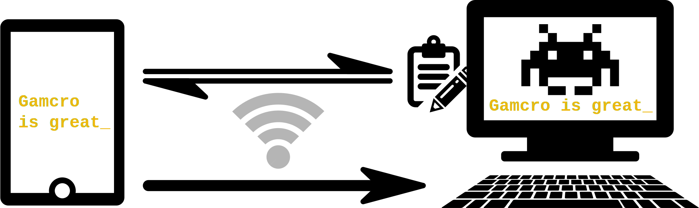

# Stop the war in Ukraine!

----

# amcro

Gamcro: Game Macros allow you to send input from networked devices that
can run decent web browsers to the program on your computer that is
currently active - i.e. that is in the foreground. This can be quite
useful, for example when playing a computer game.

_But before you continue: Keep in mind that programs like Gamcro can
also be a serious security risk. Imagine that such a program is
running while you are using your banking web portal and a bad guy
manages to send remote input – what evil things he can do._

~~Now, you have been warned and Gamcro comes with some security
mechanisms. See section about Security.~~ However, keep the following
advise in mind:

0. **Don't use Gamcro!** Currenty Gamcro has insufficient CSRF protection!  

1. Enter a passphrase to make sure that the TLS certificate's private key
   file is encrypted.

2. Let Gamcro write the `auth.txt` file. Then the password is stored as a
   salted hash.

3. Be careful when using Gamcro with games where one can perform
   security-sensitive actions, e.g. µ-Transactions, from within the
   game.

4. Run Gamcro only as long as you need it and keep the game you play
   in the foreground.

## Using Gamcro

Currently Gamcro comes as a GUI or as a terminal application that runs
on the computer to which you want to send your input. After you have one
of them running, you connect to it with a web browser form your
tablet, smart phone or perhaps a second computer – just to find the
following screen:

It allows you to make your game machine _type_ something or to _clip_
something to the clipboard. To do that you can use the “Quick type” or
“Quick clip” input fields when you want to send some ad hoc texts. E.g.
some text you found in a gaming forum on your tablet.

If you have some texts you use regularly, e.g. to greet another player in
an online game, you also can create text lists. Those lists can be exported
and imported to share with other players. You can also save the lists on your 
Gamcro machine to load them from any web browser that connects to Gamcro.

Read more [details about installing and using Gamcro in the Wiki](https://github.com/CmdrVasquess/gamcro/wiki).

## Security

Running Gamcro as a web server on a local machine makes security
somewhat challenging. Standard mechanisms on the internet heavily rely
on a trusted 3rd party that is trusted especially by the client but
also by the server. In Gamcro's setup there simply is no 3rd party.

_Feedback on these considerations is greatly appreciated._

**Web GUI and REST API protected by HTTP Basic Auth**

Essentially one must authenticate with username and password to access
Gamcro. Just that it is called _basic_ auth does not mean that it is
more insecure than e.g. hand-craftet authentication dialogs. The
crucial point is to use it basic auth only on a secure connection.

When storing username and password in a file one should not use the
clear-text `username:password` form. Instead use Gamcro's interactive
input and then let Gamcro save the credentials with a salt and a
“password hash”—actually created with a KDF.

**Secure Connections with HTTPS**

As said above, the basic auth credentials have to be secure on their
way between web client and Gamcro. With web technology the first
thought would be TLS, i.e. using HTTPS. Then there is no 2nd
thought. Rolling your own security protocol is **the** anty-pattern of
computer security! Even if you try to use some other standard protocol
this would be more complex and thus more error prone. But
out-of-the-box HTTPS brings some challenges by itself. The most common
use of TLS requires a server certificate.

So _how does a Gamcro user get one of these certificates_.

Normal user cannot be expected to wield the openssl-wand. Luckily
X.509 certificates do not cost money any more thanks to projects like
[Let's Encrypt](https://letsencrypt.org/). But you should not be able
to find any CA in the world that signs your CRS for a private address
range like `192.168.0.1` or `[::1]`. 

This leaves us with self-signed certificates. With Go its fairly easy
to let Gamcro create self-signed certificates. Self-signed
certificates, no matter how they were created, are not accepted by
HTTP clients by default—which is a good thing. To use them with Gamcro
puts a burden upon the user:

_User must decide responsibly to accept Gamcro's self-signed
certificate._ And users must not be accustomed to doing this
light-heartedly. However, currently I don't see a way around it.

Let's go and think one step further. I don't want the user get used to
accepting self-signed certificates. If Gamcro would store the
certificate and—more importantly—its _private key_ somewhere, then
Gamcro does not need to create a new certificate on every start and
the user won't be asked every time to accept a new certificate when he
connects to Gamcro.

Nice, but storing the private key puts another burden onto the user:
_Users have to keep the_ private key _private!_ I.e. no other program
but Gamcro should be able to have access to the private key. Storing
application specific sensitive data on today's desktop OS'es is a
topic on its own and I'm currently investigating solutions. Best
advise for now: 

1. Keep access rights to the private key file as restrictive as
   possible.
2. When asked to accept the Gamcro self-signed certificate check the
   certificate.
3. When asked to accept the Gamcro self-signed certificate make sure
   you want to connect to Gamcro.

What may happen, when the private key get disclosed:

- Any web server can pretend to be Gamcro. When serving on the same
  address as Gamcro the client that already accepted the self-signed
  certificate would accept that web server.
  
- Such a web server can be a man-in-the-middle and with this it can
  spy on anything on the connection.
  
As threatening as it is, this would have to happen on the same machine
as Gamcro runs on. At least as long as nobody also tampers with your
network routing.

For the Gamcro use case I'd prefer to have HTTP encryption without
certificates. As mentioned above, Gamcro users have access to the
client and the server machine at the same time. It would be easy to
work with a shared secret to setup encryption. But as of my recent
reading, [RFC4279](https://tools.ietf.org/html/rfc4279) and
[RFC5054](https://tools.ietf.org/html/rfc5054) are not widely
supported by browsers. RSP (RFC5054), which is considered superior to
PSK-TLS (RFC4279), was [removed from TLS
1.3](https://www.gnutls.org/manual/html_node/Authentication-using-SRP.html).

**Gamcro Server Identity with Random Realm**

On each start Gamcro creates a random realm that is presented in the
Gamcro terminal window and as part of the HTTP basic auth realm. Users
should compare both when logging in.

_Note:_ When the server's private key becomes disclosed the realm may
be compromised by a MITM attack. On the other hand, if the server's
key is secure, the random realm would be only an add-on to Gamcro's
certificate.

**Gamcro only serves on the same network**

By default Gamcro does not accept connections from outside of the
local network. This can be changed with the `--clients` flag.  This is
not a real security solution but this somewhat reduces security
threats without significant drawbacks.

**Gamcro only serves one client**

Upon the first authenticated client connection, Gamcro is locked to
the client machine's address. This also is not a 100% security
solution but this somewhat reduces security threats without
significant drawbacks.

**Conclusion**

- Certificate-less TLS with proper encryption could be a good solution
  when considering the risks coming with self-signed certificates.

- Certificate-less TLS seems not to be viable. The Gamcro use case,
  where one user controls both ends of the communication channel, is
  not the typical use case of web technology.
  
- A way is needed to make the private key of the certificate
  accessible only to Gamcro.
  - Do desktop OS'es provide sufficient support for this? –
    E.g. windows credential manager definitely does not.
  - If nothing helps, the private key has to be stored in an encrypted
    file that is protected with a passphrase which the user has to
    enter when Gamcro starts.

## API

TODO

## Develop
### Prerequisites

* Web app build tools for `web-ui`: [vue-cli](https://cli.vuejs.org/) for [Vue.js 3](https://v3.vuejs.org/)

* [Go SDK](https://go.dev/) 1.16+

* TODO (TL;DR “need [cgo](https://blog.golang.org/cgo)”)

### Building

Gamcro Web GUI is build with vue-cli.

Gamcro can be build with standard `go build` command. This will produce a working executable
for development purpose. To build a distribution run `go run mk/mk.go`. This will include 
the `go generate` step and some extra flags.
